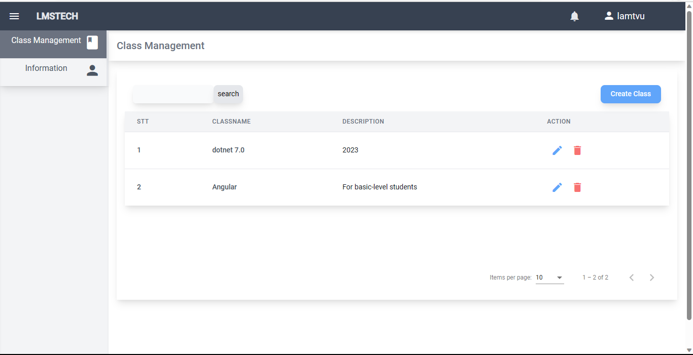

# MOCK PROJECT IN FPT

**Đề tài**: Website dạy học online

**Công nghệ sử dụng**:

- BE: ASP.NET core 5.0
- FE: Angular 12.1

**Thành Viên**: 5

## GIỚI THIỆU

- Trang web này là một hệ thống quản lý học tập cho phép giáo viên quản lý các lớp học, khóa học trong lớp, thành viên và điểm số.
  
  

## CÁCH CÀI ĐẶT

- Clone project

```
git clone https://github.com/lamtvu/LSM-web.git

```

# BE

- Di chuyển vào project be

```
cd LmsBeApp_Group06
```

- Khởi tạo database

```
dotnet ef migrations add init
dotnet ef database update

```

- Tạo roles (query file)

```
use lmsfptdb
go;

insert into roles (RoleName)
values (Admin), (Teacher), (Intructor), (Student);
go;

```

- Chạy project

```
dotnet run
```

# FE

- Di chuyển vào project be

```
cd LmsFeAppGroup06
```

- Chạy project

```
ng serve
```
